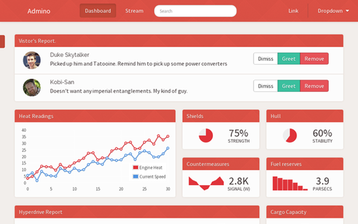
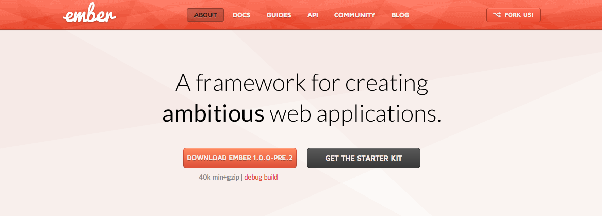
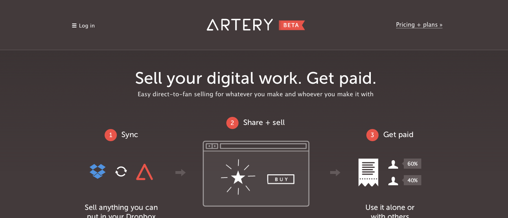
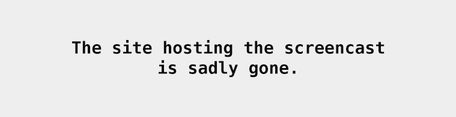
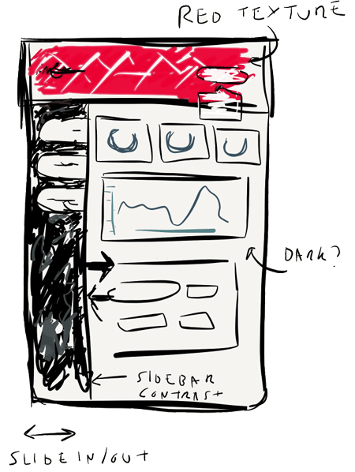

In this post, I’ll be talking about designing a website from scratch. We will explore some good starting points and helpful tips on getting the feel and mood of your design down.

5 months, 23 files and 3,528 lines of code later my ([for sale][1]) website design is done. This is the [end result.][2]

With the fruits of my labour finally done, I wanted to share the creation process.
I’ll be talking about the process from start to finish.
For anyone curious in web design, hopefully this will provide a few helpful tips for your own design projects.  Just on that note, this is my general approach but isn’t the end all (or necessarily best way) to go about designing a site. With that disclaimer in mind, let’s jump into it.
From start to finish

<iframe width="560" height="315" src="https://www.youtube.com/embed/-A3tfevse6A" frameborder="0" allowfullscreen></iframe>

Before starting work on the design, I wanted to document and capture the process. I threw together a rudimentary script to take a screenshot of the in-development site every 60 seconds. The timelapse above is the result of many hours of work condensed in 2 short minutes.

Let’s begin with often the hardest part.

Where to start
--------------

I started by thinking about what the goal of the design was.  The goal was to build a theme suitable for most web applications. Generic enough to handle the barebones of [CRUD operations][3] (possibly the most common use case for web apps) but also the ability to visualize data. The intent from the get go was to sell this design. I wanted the end product to be friendly enough to set up, customize and tweak to the specific customer’s needs, but without sacrificing the visual appeal. With the goal in mind, my next step was to start setting the mood of the design.

My design scrapbook
-------------------

When browsing the web every time I come across a design that I find interesting or impressive I’ll take a screenshot of it and store it away like a scrapbook. It’s become a habit.  Ever so often, when feeling uninspired, I’ll flick through through this design ‘scrapbook’ folder and find a beautiful reference or approach to some sort of design conundrum. In this project’s case, this was my go to point to start formulating the design. My first milestone was to create the equivalent of a mood board (mood boards are great visual tools to set the ‘feel’ of the design). Technically, this was more a mood folder then a board, but it served the exact same purpose.

Below are are some select snippets.

Snippet #1 - [emberjs.com](https://www.emberjs.com)
------------------------

[emberjs.com](https://www.emberjs.com) is a really neat site. What particularly stood out to me was the striking contrast between the red diamond textured navigation bar and main page. It’s distinctive and importantly memorable. Colors for me, are an important aspect to creating a lasting impression (good or bad). Designs lacking saturation (a.k.a black and white) can be striking but I have never found them to be particularly memorable. This might only be me, but sites that get colors right leave a lasting impression. In this case, I really liked the interplay between the colors and texture and the way the design shifts your attention below the navigation bar.

Snippet #2 - [artiery.io](https://artiery.io)
-------------------------------------------

[artery.io](http://www.artery.io) was interesting for two reason. Their landing page combines clean white typography on dark gray. This produces a high contrast striking design with great readability. The touches of color (blue and red) fit in well on the dark background (and make it memorable).

The second reason was the interaction of the sidebar. See the video below.

It felt intuitive. Hiding when not needed to maximize space for the user, but was easy to call upon when wanted. I really liked it’s convenience and wanted to capture that in my own design.

Snippet #3 - [dribbble.com](http://dribbble.com)
------------------------------------------------

Dribbble (a network of very talented graphic designers and digital artists from all around the world) is a great bucket of inspiration. After exhausting my ‘scrapbook’ folder, this was my next destination. I really liked the layout of this particular sidebar by [Jason Mayo](http://dribbble.com/madebymayo). The contrast from sidebar to main page is distinct and communicates a clear separation of functionality to the user. The active ‘tab’ in the sidebar clearly links to the main page by sharing the same colour. It’s intention is so obvious and intuitive.

With a few ideas in the pipeline, the next step was to begin crafting the UI.

Pen and *paper*
-------------

Before touching any code, I like to prototype any initial ideas with ‘pen and paper’ (in this case, I used an electronic equivalent, an iPad app called [Paper](http://www.fiftythree.com/paper)). Mockups are great starting points. Any mistakes on *paper* are cheap and effortless to correct (unlike code). Mockups can also serve as great reference points further down a project’s life. Working top down from a mock up can serve as an effective way to plan what to do next.

The level of detail is a preference and project specific. In [REWORK](http://www.amazon.co.uk/gp/product/0091929784/ref=as_li_qf_sp_asin_tl?ie=UTF8&camp=1634&creative=6738&creativeASIN=0091929784&linkCode=as2&tag=baby04c1-21) they talks about using a sharpie pen to restrict the amount of detail. This is a neat trick to force a more layout oriented approach rather than worry about the nitty gritty. You’ll find yourself asking ‘where shall I place the login button?’ instead of ‘should the login button have rounded corners?’.

The original mockup for this project is above. Mockups can undergo several passes and revisions (even beyond the start of a project). When creating a mockup I try to first focus on structure. What should the layout be? How will components fit together?
After the first pass, I’ll usually go back in and add more specifics (any user interaction, color ideas, etc).
The level of detail in a mockup varies between projects. I’ll try to get a mockup to a point where it summarize the core ideas of a design but is not bogged down with details (e.g. shadows on buttons, copy, etc).

Once I felt happy with the mockup. It was time to start coding. Using bootstrap as my base layout, I built additional less files around the existing bootstrap code in order to keep it as compatible with future versions. Like the mockup, I focused on big picture things first, like the layout, spacing and typography. Once happy with that, I then focused down to details (button styles, forms and inputs, individual elements). The timelapse does a decent job showing this process. Lots of it was trial and error, seeing how the html/css looked in practice and adjusting accordingly.  

That is all for this post. Hope it helps and would love to hear how you approach building a fresh site in the comments.

[1]: https://wrapbootstrap.com/theme/admino-fixed-width-admin-template-WB064S498?ref=cameron
[2]: http://wrapbootstrap.com/preview/WB064S498
[3]: http://en.wikipedia.org/wiki/Create,_read,_update_and_delete
